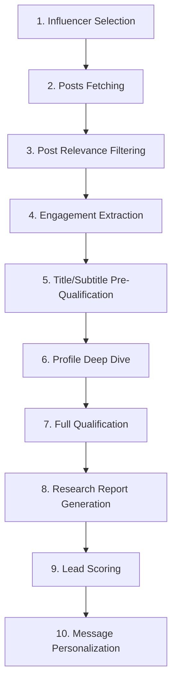

# Influencer-Based Lead Generation System Architecture V2

## 🎯 System Overview

A sophisticated lead generation system that leverages influencer audiences to identify and qualify high-value prospects. Instead of processing random LinkedIn profiles, we tap into engaged communities around relevant influencers.

## 📊 Workflow Pipeline



## 🔄 Detailed Workflow Steps

### Step 1: Influencer Selection
**Input**: LinkedIn profile URL of target influencer
**Process**: 
- Verify influencer targets our desired audience
- Fetch influencer profile to understand their focus
**API**: `getPersonDeepProfile`
**Output**: Validated influencer profile

### Step 2: Posts Fetching
**Input**: Influencer profile URL
**Process**: 
- Fetch all recent posts (paginated)
- Store post metadata and engagement metrics
**API**: `getPersonPosts` (with pagination)
**Output**: List of posts with engagement data

### Step 3: Post Relevance Filtering (LLM)
**Input**: Post content and context
**Process**: 
- Analyze post content for relevance to our ICP
- Keywords: outbound sales, lead generation, sales automation, GTM, etc.
- Filter posts by engagement threshold
**LLM Analysis**: GPT-4 to understand context and relevance
**Output**: Filtered list of relevant posts

### Step 4: Engagement Extraction
**Input**: Relevant post URLs
**Process**: 
- Get post details with reaction/comment URNs
- Fetch all likers (reactions)
- Fetch all commenters
- Deduplicate engaged users
**APIs**: 
- `getPostData` (get URNs)
- `getPostReactions` (paginated)
- `getPostComments` (paginated)
**Output**: List of engaged profiles with basic info

### Step 5: Title/Subtitle Pre-Qualification
**Input**: Engaged user profiles (title, subtitle, profile URL)
**Process**: 
- LLM analysis of title/subtitle only
- Quick filtering for obvious non-matches
- Identify decision-maker titles
**LLM Analysis**: Quick qualification based on limited data
**Output**: Pre-qualified lead list

### Step 6: Profile Deep Dive
**Input**: Pre-qualified profile URLs
**Process**: 
- Fetch full profile data
- Rate limit management
- Cache profiles in database
**API**: `getPersonDeepProfile`
**Output**: Complete profile data

### Step 7: Full Qualification
**Input**: Complete profiles
**Process**: 
- Decision maker analysis
- Competitor check
- Influencer score calculation
- Apply our existing qualification logic
**Output**: Fully qualified leads

### Step 8: Research Report Generation
**Input**: Qualified profiles + company data
**Process**: 
- Fetch company profile
- Aggregate all relevant data
- Generate comprehensive research report
**APIs**: `getCompanyProfile`
**LLM**: Generate insights and pain points
**Output**: Detailed research report per lead

### Step 9: Lead Scoring
**Input**: All collected data
**Process**: 
- Engagement level with influencer content
- Profile fit score
- Company fit score
- Timing signals
- Budget indicators
**Output**: Lead score 0-100

### Step 10: Message Personalization
**Input**: Lead data + research + influencer context
**Process**: 
- Reference specific post they engaged with
- Mention shared connection (influencer)
- Address identified pain points
- Craft personalized outreach
**LLM**: Generate highly personalized messages
**Output**: Ready-to-send LinkedIn message

## 💾 Database Schema V2

```sql
-- Influencers table
CREATE TABLE influencers (
    id INTEGER PRIMARY KEY,
    linkedin_url TEXT UNIQUE,
    full_name TEXT,
    headline TEXT,
    follower_count INTEGER,
    target_audience_match BOOLEAN,
    profile_data JSON,
    added_at TIMESTAMP
);

-- Posts table
CREATE TABLE posts (
    id INTEGER PRIMARY KEY,
    influencer_id INTEGER REFERENCES influencers(id),
    post_url TEXT UNIQUE,
    content TEXT,
    posted_at TIMESTAMP,
    reactions_count INTEGER,
    comments_count INTEGER,
    reactions_urn TEXT,
    comments_urn TEXT,
    is_relevant BOOLEAN,
    relevance_score FLOAT,
    post_data JSON
);

-- Engagements table
CREATE TABLE engagements (
    id INTEGER PRIMARY KEY,
    post_id INTEGER REFERENCES posts(id),
    profile_url TEXT,
    engagement_type TEXT, -- 'reaction' or 'comment'
    reaction_type TEXT, -- if reaction
    comment_text TEXT, -- if comment
    title TEXT,
    subtitle TEXT,
    is_pre_qualified BOOLEAN,
    pre_qualification_reason TEXT
);

-- Enhanced profiles table
CREATE TABLE profiles_v2 (
    id INTEGER PRIMARY KEY,
    linkedin_url TEXT UNIQUE,
    source_type TEXT, -- 'influencer_engagement' or 'direct'
    source_influencer_id INTEGER REFERENCES influencers(id),
    source_post_id INTEGER REFERENCES posts(id),
    -- existing profile fields...
    engagement_score INTEGER, -- based on influencer interactions
    research_report JSON,
    personalized_message TEXT
);
```

## 🏗️ System Components

### 1. Influencer Manager
```python
class InfluencerManager:
    - add_influencer(url)
    - validate_audience_match(profile)
    - get_active_influencers()
    - track_performance(influencer_id)
```

### 2. Content Analyzer
```python
class ContentAnalyzer:
    - fetch_posts(influencer_url, limit)
    - analyze_relevance(post_content)
    - score_engagement(post_metrics)
    - filter_high_value_posts(posts)
```

### 3. Engagement Harvester
```python
class EngagementHarvester:
    - extract_post_engagers(post_url)
    - get_reactions(reactions_urn, pages)
    - get_comments(comments_urn, pages)
    - deduplicate_profiles(engagers)
```

### 4. Intelligent Pre-Qualifier
```python
class PreQualifier:
    - quick_qualify(title, subtitle)
    - batch_prequalify(profiles)
    - identify_decision_makers(profiles)
    - filter_obvious_mismatches(profiles)
```

### 5. Enhanced Lead Scorer
```python
class LeadScorerV2:
    - calculate_engagement_score(profile, posts)
    - assess_timing_signals(activity)
    - evaluate_company_fit(company_data)
    - generate_composite_score(all_signals)
```

### 6. Research Engine
```python
class ResearchEngine:
    - compile_profile_research(profile)
    - analyze_company_context(company)
    - identify_pain_points(data)
    - generate_insights(compiled_data)
```

### 7. Message Crafter
```python
class MessageCrafter:
    - craft_personalized_message(lead, context)
    - reference_engagement(post, interaction)
    - mention_shared_connection(influencer)
    - create_value_proposition(pain_points)
```

## 📈 Advantages Over V1

1. **Higher Quality Leads**: Pre-validated by engagement with relevant content
2. **Warmer Outreach**: Natural conversation starter through shared content
3. **Better Qualification**: Engagement patterns provide additional signals
4. **Scalability**: One influencer can yield hundreds of qualified leads
5. **Context-Rich**: Know exactly what interests prospects

## 🚀 Implementation Phases

### Phase 1: Core Pipeline (Week 1)
- Influencer management
- Post fetching and filtering
- Engagement extraction

### Phase 2: Qualification Engine (Week 2)
- Pre-qualification system
- Enhanced profile fetching
- Full qualification logic

### Phase 3: Intelligence Layer (Week 3)
- Research report generation
- Advanced lead scoring
- Message personalization

### Phase 4: Optimization (Week 4)
- Performance tuning
- Batch processing
- Analytics dashboard

## 🎯 Success Metrics

1. **Lead Quality Score**: Average qualification score
2. **Engagement Rate**: Response rate to outreach
3. **Conversion Rate**: Lead to opportunity conversion
4. **Processing Efficiency**: Leads qualified per hour
5. **Cost per Qualified Lead**: API costs / qualified leads

## 🔧 Configuration

```yaml
influencer_config:
  min_followers: 10000
  target_keywords:
    - "B2B sales"
    - "outbound"
    - "lead generation"
    - "sales automation"
  
post_filtering:
  min_engagement: 50
  max_age_days: 90
  relevance_threshold: 0.7

qualification:
  pre_qualify_threshold: 0.6
  full_qualify_threshold: 0.8
  
rate_limits:
  api_delay: 2.0
  max_retries: 3
  batch_size: 50
```

## 🎨 Sample Workflow Output

```
Influencer: Sarah Chen (VP Sales @ TechCorp)
Post: "5 ways AI is transforming outbound sales..."
Engagements: 234 reactions, 45 comments

Pre-Qualified: 67/279 profiles
Fully Qualified: 23/67 profiles

Top Lead:
- Name: John Smith
- Title: VP Sales @ StartupXYZ  
- Score: 92/100
- Engagement: Commented "This resonates! We're struggling with..."
- Message: "Hi John, I noticed your comment on Sarah's post about AI in outbound sales. Your point about [specific challenge] really resonated..."
```

This architecture provides a sophisticated, scalable system for finding high-quality leads through influencer engagement patterns.