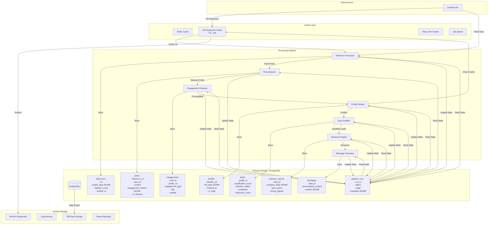

# V2 Data Flow & Storage Architecture

## 📊 Complete Data Flow Diagram



## 💾 Table Schemas Based on Real Data

### 1. `influencers` Table
```sql
CREATE TABLE influencers (
    id SERIAL PRIMARY KEY,
    linkedin_url VARCHAR(255) UNIQUE NOT NULL,
    full_name VARCHAR(255),
    headline TEXT,
    follower_count INTEGER,
    connection_count INTEGER,
    about_text TEXT,
    profile_data JSONB,  -- Full API response
    audience_match_score FLOAT,  -- 0-1 score
    verified_at TIMESTAMP,
    created_at TIMESTAMP DEFAULT NOW(),
    updated_at TIMESTAMP DEFAULT NOW()
);

CREATE INDEX idx_influencers_url ON influencers(linkedin_url);
CREATE INDEX idx_influencers_audience ON influencers(audience_match_score);
```

### 2. `posts` Table
```sql
CREATE TABLE posts (
    id SERIAL PRIMARY KEY,
    influencer_id INTEGER REFERENCES influencers(id),
    post_url VARCHAR(500) UNIQUE NOT NULL,
    post_urn VARCHAR(255),  -- LinkedIn's internal ID
    content TEXT,
    posted_at TIMESTAMP,
    
    -- Engagement metrics
    reactions_count INTEGER DEFAULT 0,
    comments_count INTEGER DEFAULT 0,
    shares_count INTEGER DEFAULT 0,
    reactions_urn VARCHAR(255),  -- For fetching reactions
    comments_urn VARCHAR(255),   -- For fetching comments
    
    -- Analysis results
    is_relevant BOOLEAN DEFAULT NULL,
    relevance_score FLOAT,
    relevance_keywords TEXT[],
    
    -- Raw data
    post_data JSONB,
    
    created_at TIMESTAMP DEFAULT NOW()
);

CREATE INDEX idx_posts_influencer ON posts(influencer_id);
CREATE INDEX idx_posts_relevant ON posts(is_relevant, relevance_score);
```

### 3. `engagements` Table
```sql
CREATE TABLE engagements (
    id SERIAL PRIMARY KEY,
    post_id INTEGER REFERENCES posts(id),
    profile_url VARCHAR(255),
    profile_urn VARCHAR(255),
    engagement_type VARCHAR(20), -- 'reaction' or 'comment'
    reaction_type VARCHAR(20),   -- 'LIKE', 'LOVE', etc.
    comment_text TEXT,
    
    -- Pre-qualification data
    title VARCHAR(500),
    subtitle VARCHAR(500),
    is_pre_qualified BOOLEAN DEFAULT NULL,
    pre_qual_score FLOAT,
    pre_qual_reason TEXT,
    
    created_at TIMESTAMP DEFAULT NOW(),
    
    UNIQUE(post_id, profile_url, engagement_type)
);

CREATE INDEX idx_engagements_post ON engagements(post_id);
CREATE INDEX idx_engagements_qualified ON engagements(is_pre_qualified);
```

### 4. `profiles` Table (Enhanced)
```sql
CREATE TABLE profiles (
    id SERIAL PRIMARY KEY,
    linkedin_url VARCHAR(255) UNIQUE NOT NULL,
    
    -- Basic info
    full_name VARCHAR(255),
    headline TEXT,
    location VARCHAR(255),
    
    -- Metrics
    follower_count INTEGER,
    connection_count INTEGER,
    
    -- Full data
    profile_data JSONB,
    experiences JSONB,
    educations JSONB,
    skills TEXT[],
    
    -- Tracking
    source_type VARCHAR(50), -- 'influencer_engagement', 'direct'
    source_influencer_id INTEGER REFERENCES influencers(id),
    fetched_at TIMESTAMP,
    is_stale BOOLEAN DEFAULT FALSE,
    
    created_at TIMESTAMP DEFAULT NOW(),
    updated_at TIMESTAMP DEFAULT NOW()
);
```

### 5. `pipeline_runs` Table
```sql
CREATE TABLE pipeline_runs (
    id SERIAL PRIMARY KEY,
    run_id VARCHAR(100) UNIQUE NOT NULL,
    
    -- Configuration
    influencer_id INTEGER REFERENCES influencers(id),
    config JSONB,  -- Runtime configuration
    
    -- State tracking
    current_stage VARCHAR(50),
    status VARCHAR(20), -- 'running', 'completed', 'failed', 'paused'
    
    -- Progress metrics
    posts_fetched INTEGER DEFAULT 0,
    posts_filtered INTEGER DEFAULT 0,
    engagements_extracted INTEGER DEFAULT 0,
    profiles_fetched INTEGER DEFAULT 0,
    leads_qualified INTEGER DEFAULT 0,
    
    -- Timing
    started_at TIMESTAMP,
    completed_at TIMESTAMP,
    
    -- Error handling
    error_message TEXT,
    error_context JSONB,
    
    -- Results
    results JSONB,
    
    created_at TIMESTAMP DEFAULT NOW(),
    updated_at TIMESTAMP DEFAULT NOW()
);

CREATE INDEX idx_runs_status ON pipeline_runs(status, started_at);
```

## 🔄 State Management Flow

```python
# Example: How data flows through states

async def process_influencer(influencer_url: str, run_id: str):
    # 1. Initialize run
    run = PipelineRun(
        run_id=run_id,
        influencer_url=influencer_url,
        status="running",
        current_stage="influencer_fetch"
    )
    await save_run_state(run)
    
    # 2. Fetch influencer (with caching)
    cache_key = f"influencer:{influencer_url}"
    influencer_data = await redis.get(cache_key)
    
    if not influencer_data:
        influencer_data = await linkedin_api.get_person_deep(influencer_url)
        await redis.setex(cache_key, 86400, influencer_data)  # 24h cache
    
    # 3. Store in PostgreSQL
    influencer = await store_influencer(influencer_data)
    
    # 4. Update state
    run.current_stage = "posts_fetch"
    await save_run_state(run)
    
    # Continue through pipeline...
```

## 📈 Data Volume Estimates

Based on typical influencer engagement:

```
1 Influencer
├── ~50 Posts (last 3 months)
├── ~10 Relevant Posts
│   ├── ~200 Engagers per post
│   ├── 2,000 Total Engagers
│   ├── ~500 Pre-qualified (25%)
│   └── ~100 Fully Qualified (5%)
└── 100 Final Leads

Storage Requirements:
- Influencer: ~10KB (with JSONB)
- Posts: 50 * 5KB = 250KB
- Engagements: 2000 * 1KB = 2MB
- Profiles: 100 * 20KB = 2MB
- Total per influencer: ~4.3MB

For 100 influencers/month:
- Storage: ~430MB/month
- API Calls: ~10,000
- Processing Time: ~50 hours
```

## 🚨 Critical Design Decisions

### 1. **Why PostgreSQL + JSONB?**
- Relational integrity for core data
- JSONB for flexible API responses
- Single source of truth
- Powerful querying capabilities

### 2. **Why Redis for Caching?**
- Sub-millisecond response times
- TTL support for automatic cleanup
- Pub/sub for real-time updates
- Battle-tested at scale

### 3. **Why Separate Tables vs One Big Table?**
- Clear data boundaries
- Optimized queries for each stage
- Easier to scale specific components
- Better for team collaboration

### 4. **Why Stage-based Processing?**
- Resume from any point
- Clear progress tracking
- Easier debugging
- Cost optimization (stop early if needed)

## 🔍 Monitoring Queries

```sql
-- Pipeline health
SELECT 
    status,
    current_stage,
    COUNT(*) as count,
    AVG(EXTRACT(EPOCH FROM (completed_at - started_at))) as avg_duration_seconds
FROM pipeline_runs
WHERE started_at > NOW() - INTERVAL '24 hours'
GROUP BY status, current_stage;

-- Lead quality trends
SELECT 
    DATE(created_at) as date,
    COUNT(*) as total_leads,
    AVG(qualification_score) as avg_score,
    SUM(CASE WHEN qualification_score > 80 THEN 1 ELSE 0 END) as high_quality_leads
FROM leads
GROUP BY DATE(created_at)
ORDER BY date DESC;

-- API efficiency
SELECT 
    DATE(fetched_at) as date,
    COUNT(*) as api_calls,
    SUM(CASE WHEN is_stale THEN 1 ELSE 0 END) as cache_misses,
    (COUNT(*) - SUM(CASE WHEN is_stale THEN 1 ELSE 0 END))::FLOAT / COUNT(*) as cache_hit_rate
FROM profiles
GROUP BY DATE(fetched_at);
```

This architecture gives us:
- **Flexibility** through JSONB
- **Performance** through caching
- **Reliability** through state management
- **Visibility** through comprehensive logging
- **Scalability** through modular design

Ready to start building with real data!